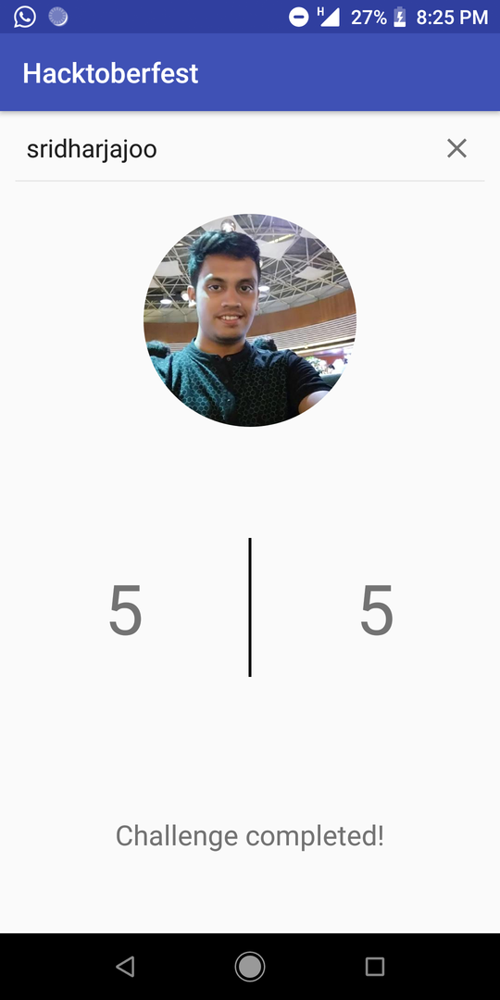

# About Hacktoberfest
[Hacktoberfest](http://hacktoberfest.digitalocean.com/) is a month-long celebration of open source software run by DigitalOcean. Hacktoberfest is open to everyone in our global community!You just need to make four contributions to open source before October 31 and can receive a free Hacktoberfest t-shirt.

# Hacktoberfest-tracker
An app to track your hacktoberfest contributions. The following libraries have been taken into use during the time of building the app:

- Dagger 2
- Lombok
- RxJava
- Picasso
- Retrofit

#### Dependency Injection

Dagger 2 for DI has been used in this project. If any new activity is created or a fragment is created then it must be added under the '@ContributesAndroidInjector' tag.

App Screenshot:

This project is currenly under development by [Sridhar Jajoo](https://github.com/sridharjajoo)
